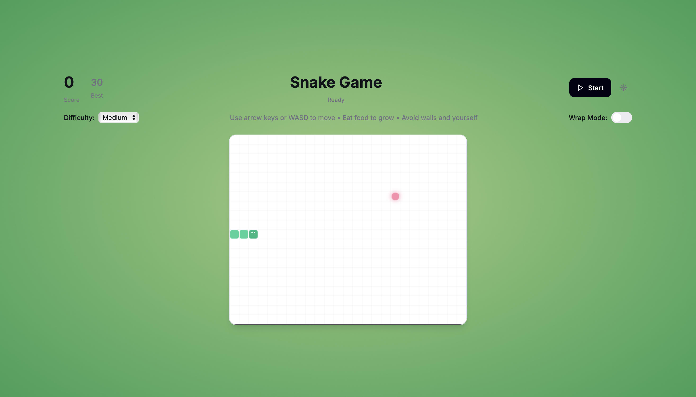
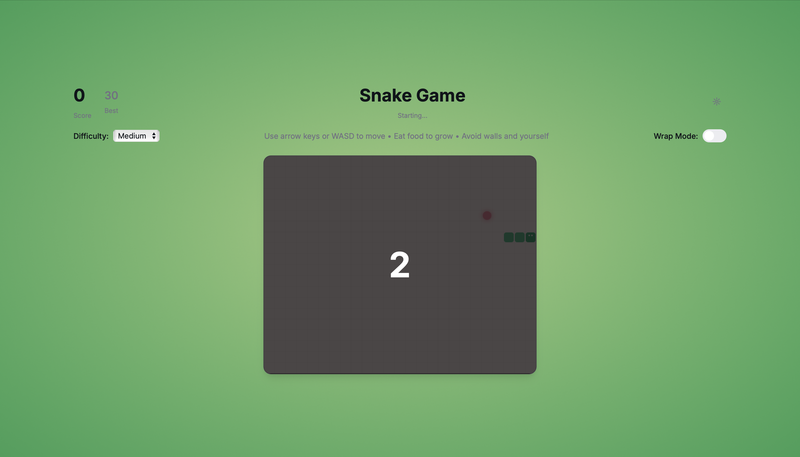
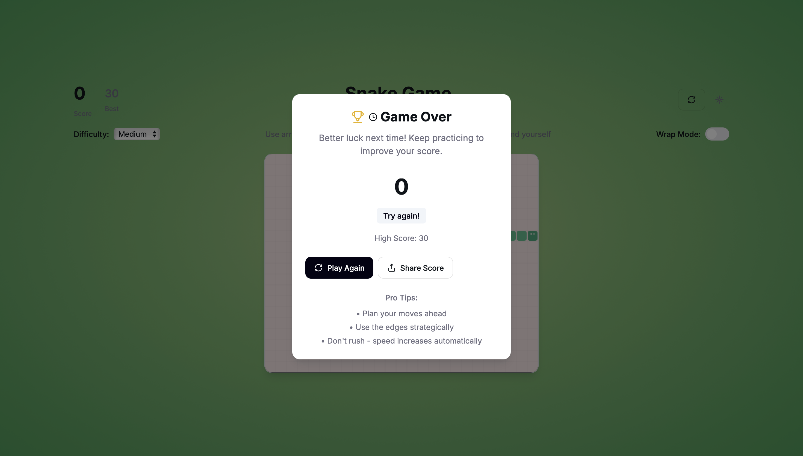

# snake-game-using-plain-html
🐍 A modern Snake Game built using HTML, CSS, and vanilla JavaScript. The game features smooth animations, a responsive grid layout, score tracking, and keyboard controls (Arrow keys or WASD). Eat the food to grow longer, but avoid colliding with yourself!


# 🐍 Snakely — Snake Game in HTML, CSS, and JavaScript

A modern twist on the classic Snake Game, built entirely using HTML, CSS, and vanilla JavaScript — no libraries or frameworks. The game is responsive, visually smooth, and easy to play with keyboard controls.

## 🎮 Features
- **Classic Snake Gameplay** — Grow your snake by eating food.
- **Responsive Design** — Works on different screen sizes.
- **Smooth Animations** — CSS transitions and JavaScript updates.
- **Keyboard Controls** — Use Arrow Keys or WASD.
- **Score Tracking** — See how many points you can get.
- **Self-Collision Detection** — Game restarts when you bite yourself.

## 🖥️ How to Play
1. **Start the game** — Open `index.html` in your browser.
2. **Move the snake** — Use:
   - **Arrow Keys** (↑ ↓ ← →)  
   - **WASD keys** (W A S D)
3. **Eat the food** — The snake grows and your score increases.
4. **Avoid colliding with yourself** — Game will reset if you do.

## 📂 Project Structure
.
├── index.html   # Main game file (HTML + CSS + JS in one)

## 🚀 Getting Started
1. Clone this repository:
   ```bash
   git clone https://github.com/SaniaDebbarma/snake-game-using-plain-html/tree/main

   	2.	Open index.html in your favorite browser.
	3.	Play and have fun!

🛠️ Built With
	•	HTML5 — Structure
	•	CSS3 — Styling and animations
	•	JavaScript (Vanilla) — Game logic and interactions

📷 Screenshots

 
 
 


📜 License

This project is licensed under the MIT License — feel free to use and modify.

